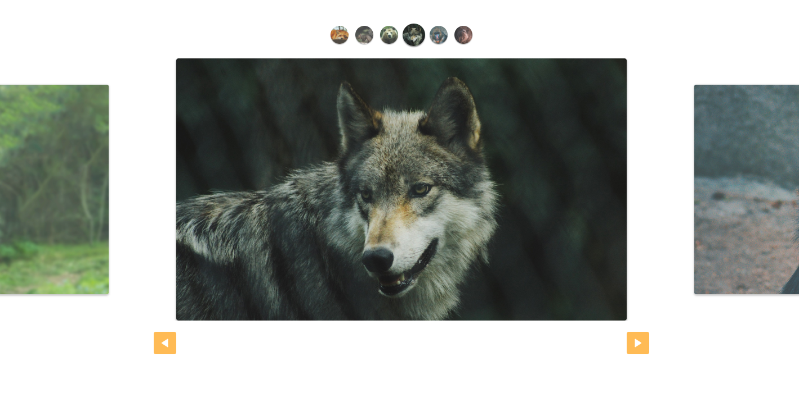

<h1 align="center">Slide Javascript</h1>

<a href="https://rafaelofil.github.io/slide/" target="_blank">
  
</a>

## Table of contents
* [General info](#general-info)
* [Technologies](#technologies)
* [Setup](#setup)
* [Final Considerations](#final-considerations)

## General Info
<p>Interactive slide made with JavaScript. It's possible navigation in slide of three ways,clicking on icon images, dragging the central images or by clicking the arrow buttons.</p>
<p>The project could be reused in another front-end aplications, just need adjust the parameters.</p>

## Technologies
Project is created with:

* HTML5
* JavaScript
* CSS3

## Setup
To run this project in local is necessary:

```
$ npm clone git@github.com:rafaelofil/slide.git
```
Or download the repository, after that just open.

You can acess the link and check the slide : https://rafaelofil.github.io/slide/

## Final considerations

<p>Made in the Origamid JavaScript ES6 course.</p>
<p>Any doubt, feel free to get in touch.</p>

<hr>
<p align="center"> I hope you enjoy 😎</p>
